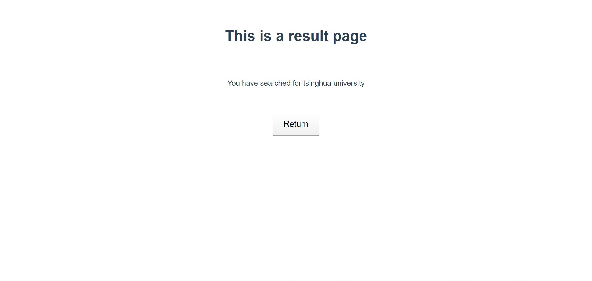
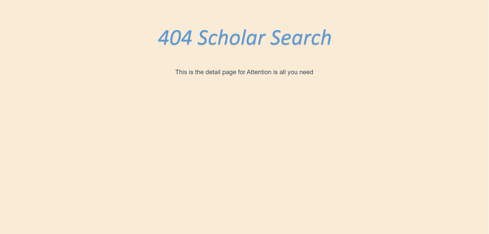

# 404-Scholar-Search
This is the front end of the team project in SOA
  
The web page is currently available on 123.57.231.102:8000.  

If you want to set up local host on your own device, use following instructions:  

    cd search
    npm run dev

If you haven't installed Vue CLI, first install node.js, then use following instructions to install:  

    npm install -g @vue/cli  

We use *element-ui* as our UI framework. Please refer to **https://element.eleme.cn** for further information.

Our current frontpage should look like this:  
  

Our result page should look like this:

Our detail page should look like this:  

  
**Note**: Current version uses http api provided by backend on 123.57.231.102. Please refer to https://github.com/SigmaTsing/404-backend/tree/develop for details. 
