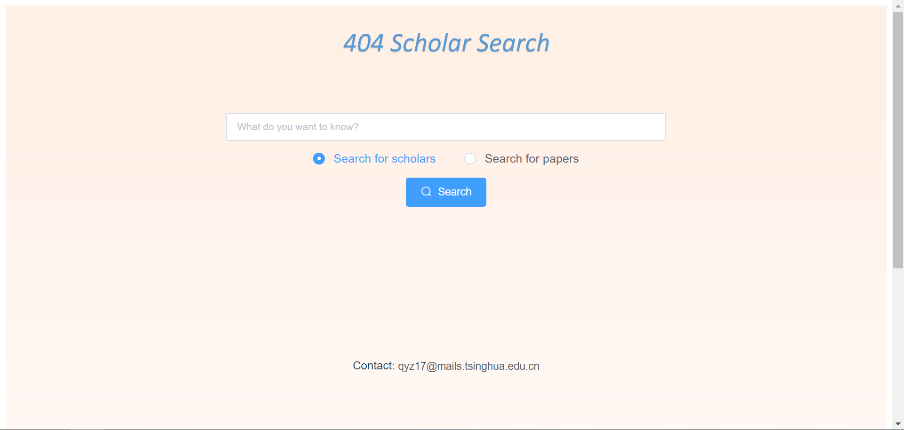
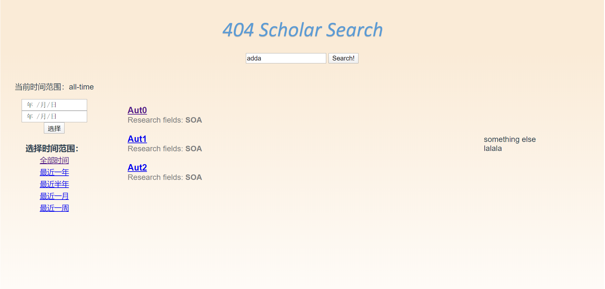
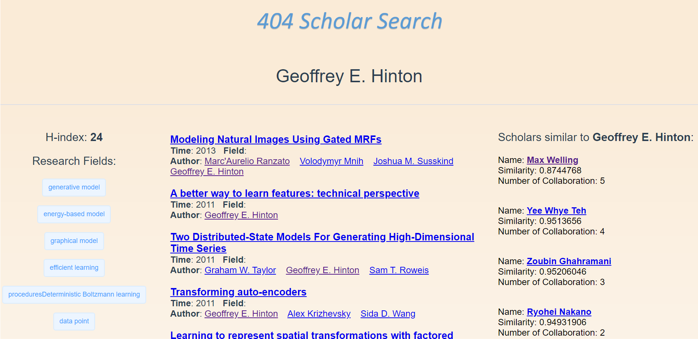

# 404-Scholar-Search
This is the front end of the team project in SOA
  
We use Vue CLI to set up local host.  
To start, use following instructions:  

    cd search
    npm run dev

If you haven't installed Vue CLI, first install node.js, then use following instructions to install:  

    npm install -g @vue/cli  

Our current frontpage should look like this:  
  

Our result page should look like this:

Our detail page should look like this:  

  
**Note**: Current version uses http api provided by backend on local host. Please refer to https://github.com/SigmaTsing/404-backend/tree/develop for details. 
